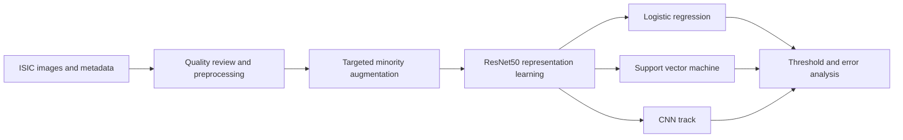

  

  
  
  

An academic study of skin lesion malignancy classification in the ISIC 2024
setting, where a clinically important positive class represents roughly one
tenth of one percent of the available cases.

> Developed collaboratively as a university team project. This repository
> presents the research design and evidence boundary; notebooks, reports, and
> data dependent artifacts remain in a private archive.

## The central problem

<table>
  <tr>
    <td align="center"><strong>401,059</strong> total cases</td>
    <td align="center"><strong>400,666</strong> benign</td>
    <td align="center"><strong>393</strong> malignant</td>
    <td align="center"><strong>0.098%</strong> positive prevalence</td>
    <td align="center"><strong>40,000</strong> balanced study set</td>
  </tr>
</table>

With this level of imbalance, a model can report excellent accuracy while
missing nearly every malignant case. A constant predictor that answers benign
for every input scores **99.90 percent accuracy** on this distribution while
detecting zero cancers, which is the reason accuracy is not reported anywhere in
this study.

Sensitivity, specificity, precision, recall, calibration, and threshold
behaviour are the measurements that carry meaning here, and the threshold is
part of the result rather than a detail chosen afterwards.

## Study design

## Method map

| Stage | Purpose |
| --- | --- |
| Image preprocessing | Standardize inputs and inspect quality variation |
| Targeted augmentation | Increase minority exposure without claiming new patients |
| ResNet50 representations | Produce 2,048 dimensional features from ImageNet weights |
| Logistic regression and SVM | Compare classical decision boundaries |
| Imbalance handling | Reduce majority class dominance during learning |
| Threshold analysis | Examine sensitivity and false positive tradeoffs |

## Evidence status

The private archive preserves the CNN, logistic regression, SVM, and
preprocessing notebooks together with the academic report and model notes.

| Check | Result |
| --- | --- |
| Selected notebook structure | 5 valid notebook files |
| Archive integrity | Preserved files match the original archive by SHA256 |
| Full training rerun | Not completed during portfolio preparation |
| External clinical validation | Not performed |
| Published performance figures | **None.** No frozen evaluation run exists to report from |

Some notebooks still depend on local paths and on data that is not distributed
through GitHub. The project therefore remains a research archive until the
experiment is rebuilt around a documented, patient level protocol.

## What the study does not claim

1. It is not a clinically validated diagnostic system.
2. It does not establish performance on an external hospital population.
3. Augmented images do not replace independent malignant examples.
4. Notebook outputs do not replace a frozen evaluation protocol.

## Public and private boundary

This public repository contains the research question, methodology, evidence
status, limitations, and next steps. The notebooks and report remain private
while reproducibility, team approval, and dataset handling are reviewed. The
large ISIC image collection is not stored in GitHub.

## Roadmap

1. Rebuild the experiment around a documented patient level split.
2. Compare weighting, sampling, and focal loss under one protocol.
3. Report confidence intervals, calibration, and threshold curves.
4. Add subgroup and failure mode analysis.
5. Package preprocessing and evaluation as reproducible stages.

## Responsible use

This project is educational research. It must not be used for diagnosis or
clinical decision making. Any future release should point to the official ISIC
data source instead of redistributing medical images.
