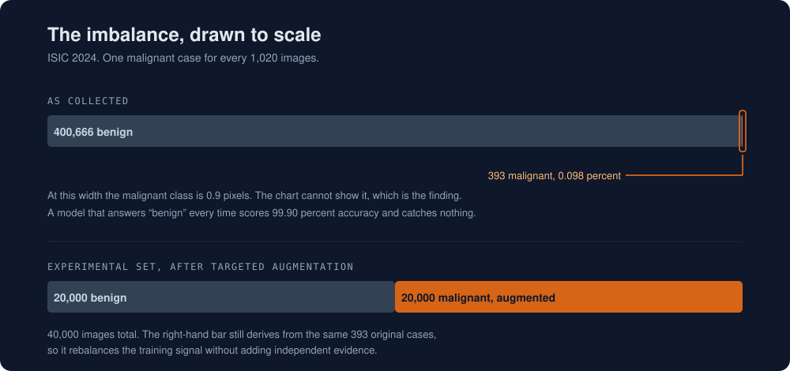
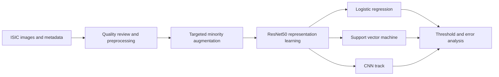

Concept illustration. The study distribution diagram appears below.

# Skin Lesion ML Study

**When 99.90% accuracy can still miss every positive case.**

A university team study of skin lesion malignancy classification in the ISIC 2024 setting, focused on extreme class imbalance, image preprocessing, and model comparison.

**Academic research archive** · **Private notebooks and reports** · **No published performance benchmark**

[The challenge](#the-challenge) · [My contribution](#my-contribution) · [Study design](#study-design) · [Evidence](#evidence-status)

## The challenge

| Available dataset | Cases |
| --- | ---: |
| Benign | 400,666 |
| Malignant | 393 |
| **Total** | **401,059** |
| **Positive prevalence** | **0.098%** |

A constant predictor that labels every case benign would achieve approximately **99.90% accuracy** on this distribution while identifying **zero malignant cases**.

That is a calculated illustration of the imbalance, not a trained model result. Sensitivity, specificity, precision, recall, calibration, and threshold behaviour are the relevant evaluation concerns.

The documented balanced study set contains **40,000 images**. Augmentation increases image count, not the number of independent patients or original malignant cases. Available dataset size and experimental set size therefore describe different things.

## My contribution

I worked on image preprocessing and the CNN track, including targeted augmentation for the experimental set and ResNet50 representations.

| Area | My work |
| --- | --- |
| Preprocessing | Preparing lesion images for the study workflow |
| Targeted augmentation | Building the balanced experimental image set through minority augmentation |
| ResNet50 representations | Working with image representations for the model experiments |
| CNN track | Developing the convolutional model experiments |

The wider model comparison, notebooks, and study design were developed collaboratively. Results and architecture described here belong to the team project.

## Study design

| Method | Purpose |
| --- | --- |
| Image preprocessing | Standardize inputs and review quality variation |
| Targeted augmentation | Increase minority exposure during learning |
| ResNet50 representations | Extract 2,048 dimensional features using ImageNet weights |
| Logistic regression and SVM | Compare classical decision boundaries |
| CNN track | Investigate convolutional classification |
| Threshold analysis | Examine sensitivity and false positive tradeoffs |

The diagram summarizes the documented study design. It does not establish that every stage has been reproduced under a frozen evaluation protocol.

## Evidence status

The private archive preserves CNN, logistic regression, SVM, and preprocessing notebooks, together with the academic report and model notes.

| Check | Recorded status |
| --- | --- |
| Selected notebook structure | 5 valid notebook files |
| Archive integrity | Preserved files match the original archive by SHA256 |
| Full training rerun | Not completed during portfolio preparation |
| External clinical validation | Not performed |
| Published performance figures | None |

Some notebooks depend on local paths and data that is not distributed through GitHub. Archive integrity and valid notebook structure do not establish model performance.

The project remains a research archive until the experiment is rebuilt around a documented patient level protocol. Existing notebook outputs do not replace that evaluation.

## Next steps

1. Rebuild the experiment around a documented patient level split.
2. Compare weighting, sampling, and focal loss under one protocol.
3. Report confidence intervals, calibration, and threshold curves.
4. Add subgroup and failure mode analysis.
5. Package preprocessing and evaluation as reproducible stages.

## Repository scope

This public repository contains the research question, methodology, class distribution diagram, evidence status, limitations, and next steps.

Notebooks and reports remain private while reproducibility, team approval, and dataset handling are reviewed. The large ISIC image collection is not stored in GitHub.

## Responsible use

This project is educational research. It has not been clinically validated and must not be used for diagnosis or clinical decision making. It does not establish performance on an external hospital population.

Any future release should reference the official ISIC data source rather than redistribute medical images.
